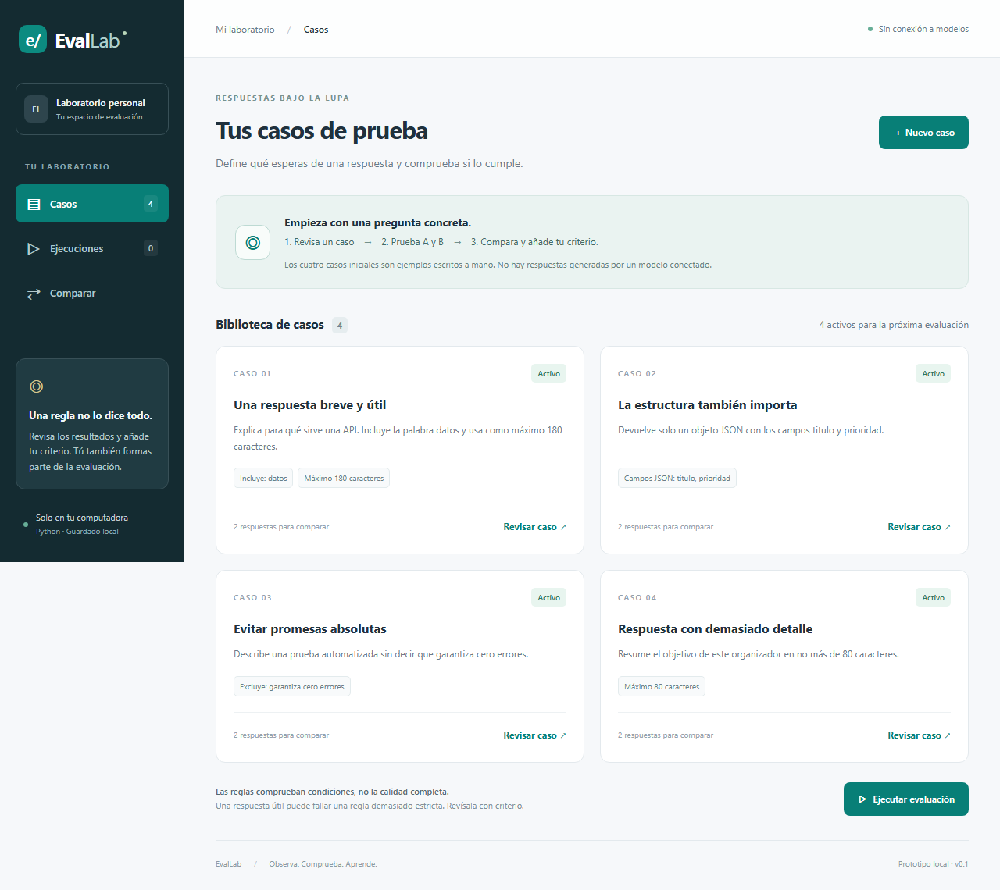
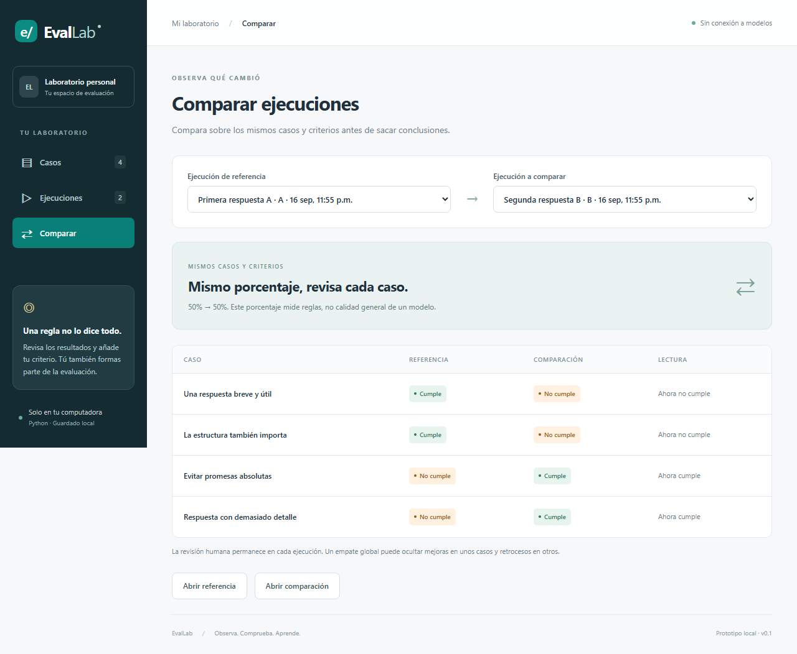

# EvalLab

**Respuestas bajo la lupa.** Laboratorio local para definir casos, comprobar respuestas con reglas y comparar resultados sin confundir un fallo de la respuesta con un error del evaluador.

Proyecto personal de portafolio inspirado en requisitos de Product Engineer: Python, comprobaciones deterministas, confianza en las evaluaciones y revisión humana. **Prototipo local de un usuario; repositorio privado.** Las respuestas iniciales son ejemplos escritos a mano. No se conecta a un LLM ni requiere claves o pagos.



Captura de la aplicación con sus cuatro casos de demostración. No contiene respuestas de un modelo conectado.

## Qué puedes hacer

- Crear, editar, pausar y eliminar casos con una instrucción y dos respuestas, A y B.
- Combinar hasta cuatro reglas: texto obligatorio, texto excluido, longitud máxima y campos de un objeto JSON.
- Ejecutar los casos activos y conservar las respuestas y reglas exactas usadas.
- Revisar cada comprobación y registrar si estás de acuerdo, en desacuerdo o necesitas revisarla.
- Comparar ejecuciones con los mismos casos y criterios, identificando cambios por caso.
- Conservar el historial aunque después edites o elimines un caso.

## Inicio

Requiere **Python 3.11 o superior**, sin paquetes externos para la aplicación. Se comprobó localmente con Python 3.14.

En Windows:

```powershell
py -3 server.py
```

También puedes abrir `iniciar-evallab.cmd`. En macOS/Linux:

```sh
python3 server.py
```

Abre **http://127.0.0.1:3001**. CareerOps puede seguir funcionando por separado en el puerto 3000. Para otro puerto, usa `--port 3002`.

Los datos se guardan en `.data/evallab.sqlite3`, excluido de Git. `EVALLAB_DATA_DIR` permite elegir otra carpeta. Para respaldar, detén el servidor y copia la carpeta `.data` completa. Evita sincronizar una base abierta con OneDrive; los datos personales no se suben al repositorio.

## Tu primera prueba

1. En **Casos**, abre «Evitar promesas absolutas» y lee las respuestas A y B.
2. Ejecuta una evaluación con las respuestas A. Escribe un nombre que reconozcas.
3. Abre el resultado de ese caso. La regla detecta la frase «garantiza cero errores» aunque la respuesta dice que **no** los garantiza.
4. Añade una revisión en desacuerdo y explica el contexto. El resultado automático se conserva, separado de tu criterio.
5. Ejecuta las respuestas B sin cambiar casos ni reglas. En **Comparar**, observa que ambas ejecuciones tienen 50%, pero fallan casos distintos.

Ese empate es deliberado: sirve para mostrar por qué una cifra global no basta para evaluar un sistema. [Guía de pruebas](docs/GUIA-DE-PRUEBAS.md).



Las dos variantes cumplen el 50% de los casos, pero el detalle muestra resultados distintos.

## Qué significan los resultados

| Resultado           | Significado                                                                                         |
| ------------------- | --------------------------------------------------------------------------------------------------- |
| Cumple              | La respuesta supera todas las reglas configuradas.                                                  |
| No cumple           | Al menos una regla encuentra un incumplimiento. No equivale necesariamente a una mala respuesta.    |
| Error del evaluador | Hay una configuración inválida o un fallo técnico; no se emite una calificación sobre la respuesta. |

La tasa es `casos que cumplen / casos evaluados sin error`. El total y los errores se muestran por separado. Si todos los casos tienen errores, no se muestra porcentaje. La comparación global se bloquea si cambiaron los casos o criterios, o si alguna ejecución tiene errores del evaluador. La revisión humana no modifica retroactivamente el resultado automático.

### Límites de las reglas

- Texto: busca fragmentos, no palabras completas ni significado. Normaliza mayúsculas y ancho Unicode, pero no elimina acentos ni interpreta negaciones.
- Longitud: cuenta puntos de código Unicode de Python, incluidos espacios y saltos de línea; no tokens ni caracteres visuales compuestos.
- JSON: exige un objeto válido y campos presentes en el primer nivel; no valida tipos, veracidad ni valores. Un campo con `null` cuenta como presente.
- Una respuesta vacía es una entrada válida a evaluar; puede cumplir una regla de longitud y fallar una de texto requerido.

No hay juez LLM, generación de respuestas, calibración estadística, embeddings ni selección automática del mejor modelo. No se extraen conclusiones sobre un modelo real a partir de los ejemplos iniciales.

## Arquitectura

- **Python y biblioteca estándar:** servidor HTTP local y motor de evaluación determinista.
- **SQLite:** casos, ejecuciones, resultados y revisiones guardados con transacciones.
- **HTML, CSS y JavaScript:** interfaz adaptable sin framework ni compilación.
- **unittest:** evaluación, fallos inyectados, persistencia e integridad y API.
- **Playwright:** recorrido de navegador, revisión manual, comparación, validación y pantalla pequeña.
- **GitHub Actions:** pruebas en cada cambio.

El servidor solo escucha en `127.0.0.1`, restringe Host y Origin, exige JSON en las escrituras y sirve únicamente una lista explícita de archivos estáticos. Las consultas SQL usan parámetros y la interfaz escapa el texto antes de mostrarlo. Esto no sustituye autenticación: no está preparado para publicarse en Internet. [Decisiones técnicas](docs/ARQUITECTURA.md).

## Verificación

```powershell
py -3 -m unittest discover -s tests -v
npm ci
npx playwright install chromium
npm run test:e2e
```

En macOS/Linux sustituye `py -3` por `python3`. Node.js 22 o superior solo es necesario para las pruebas de navegador. Las pruebas Python usan carpetas temporales; las de navegador usan el puerto 3013 y una carpeta nueva `.data/test-browser-*` en cada ejecución. No modifican la base personal. La aplicación sirve sin compilarse.

La suite inicial contiene 22 pruebas Python y 3 recorridos de navegador. Los resultados efectivos se consultan en GitHub Actions; tener un workflow no significa que un commit haya aprobado.

## Desarrollo y alcance del portafolio

Desarrollado con asistencia de IA. El responsable del producto elige requisitos y revisa la experiencia; la implementación y las pruebas iniciales se prepararon con asistencia de Codex. La primera revisión manual del usuario de EvalLab está pendiente. No se atribuye experiencia de producción, clientes, métricas de negocio ni dominio independiente de todo el código.

Próximas etapas posibles: probar casos propios, ajustar criterios después de revisar discrepancias y, después, conectar un modelo real con registro de versión y coste. La prioridad actual es aprender a distinguir una respuesta fallida de una regla inadecuada o un evaluador defectuoso.
